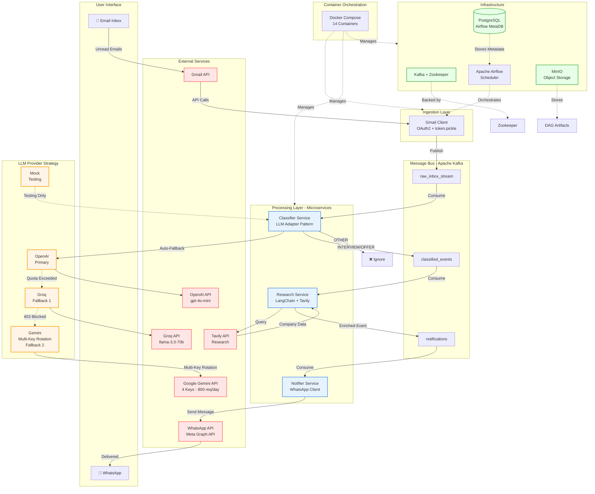

# CareerOps AI - System Architecture

## Architecture Diagram (Mermaid)



## System Components

### 1. **Ingestion Layer**
- **Gmail Client**: Polls Gmail API every 60s for unread emails
- **Authentication**: OAuth2 with token.pickle for persistent auth
- **Output**: Publishes raw email data to Kafka

### 2. **Message Bus (Kafka)**
- **Topics**:
  - `raw_inbox_stream`: Unprocessed emails from Gmail
  - `classified_events`: Emails classified as INTERVIEW/OFFER
  - `notifications`: Final notifications ready to send
- **Benefits**: Decoupling, fault tolerance, replay capability

### 3. **Processing Services**

#### Classifier Service
- **Purpose**: Detect career-related emails (INTERVIEW, OFFER, REJECTION)
- **LLM Strategy**: Adapter Pattern with auto-fallback
  1. **OpenAI GPT-4o-mini** (Primary - fastest, most reliable)
  2. **Groq Llama-3.3-70b** (Fallback 1 - high quota but Docker blocked)
  3. **Gemini 2.0-flash** (Fallback 2 - 4 keys with auto-rotation = 800 req/day)
  4. **Mock Provider** (Testing only)
- **Rate Limiting**: 540s delay between emails (Kafka-based throttling)

#### Researcher Service
- **Purpose**: Enrich classified events with company research
- **Tools**: LangChain + Tavily API
- **Output**: Company briefing, funding, recent news
- **Rate Limiting**: 3323s delay (26 researches/day)

#### Notifier Service
- **Purpose**: Send WhatsApp notifications
- **Integration**: Meta Graph API (WhatsApp Business)
- **Message Format**: Event type, company, confidence, research briefing

### 4. **Infrastructure**
- **Kafka + Zookeeper**: Message streaming
- **PostgreSQL**: Airflow metadata storage
- **Apache Airflow**: Workflow orchestration (future: scheduled reports, ML retraining)
- **MinIO**: Object storage for artifacts
- **Docker Compose**: Container orchestration (14 containers total)

### 5. **LLM Provider Strategy**

#### Multi-Key Rotation (Gemini)
```python
# 4 Gemini API Keys = 800 requests/day
GOOGLE_API_KEY=KEY1,KEY2,KEY3,KEY4

# Auto-rotation on quota exhaustion
Key1 hits quota → rotate to Key2
Key2 hits quota → rotate to Key3
...
All exhausted → fail gracefully
```

#### Auto-Fallback Logic
```python
LLM_PROVIDER=auto

try:
    classify_with_openai()
except QuotaExceeded:
    try:
        classify_with_groq()
    except NetworkError:
        classify_with_gemini()  # Multi-key rotation
```

## Data Flow

```
Email Inbox
    ↓
Gmail API (OAuth2)
    ↓
Ingestion Service
    ↓
Kafka: raw_inbox_stream
    ↓
Classifier Service (LLM Adapter)
    ├─→ OpenAI (try first)
    ├─→ Groq (fallback 1)
    └─→ Gemini (fallback 2, multi-key)
    ↓
Kafka: classified_events (INTERVIEW/OFFER only)
    ↓
Researcher Service (LangChain + Tavily)
    ↓
Kafka: notifications
    ↓
Notifier Service (WhatsApp Client)
    ↓
WhatsApp Message (User's Phone)
```

## Deployment Architecture

```
Windows 10 (14GB RAM)
    └─ Docker Desktop
        └─ Docker Compose (14 containers)
            ├─ Zookeeper (50MB)
            ├─ Kafka (400MB)
            ├─ PostgreSQL (100MB)
            ├─ Airflow Scheduler (150MB)
            ├─ Airflow Webserver (150MB)
            ├─ Airflow Init (temp)
            ├─ MinIO (100MB)
            ├─ Ingestion Service (150MB)
            ├─ Classifier Service (200MB)
            ├─ Researcher Service (200MB)
            └─ Notifier Service (150MB)
        
Total RAM Usage: ~1.8GB
Network: bridge (internal)
Volumes: postgres_data, minio_data, kafka_data
```

## API Quotas & Rate Limits

| Provider | Free Quota | Rate Limit | Status |
|----------|-----------|------------|--------|
| **OpenAI** | $5 credits | High | ⚠️ Needs billing |
| **Groq** | 14,400/day | 30/min | ⚠️ Docker blocked |
| **Gemini** | 200/day/key × 4 | 15/min | ✅ Active (800/day) |
| **Tavily** | 1000/month | Variable | ✅ Active |
| **WhatsApp** | Unlimited | Temp token (24h) | ⚠️ Token expired |

## Key Features

✅ **Fault Tolerance**: Kafka ensures no data loss  
✅ **Auto-Scaling**: Multi-key rotation multiplies quota  
✅ **Resilience**: Auto-fallback across 3 LLM providers  
✅ **Rate Protection**: Kafka-based throttling prevents quota exhaustion  
✅ **Microservices**: Independent scaling and deployment  
✅ **Production-Ready**: Logging, error handling, retries  

## Future Enhancements

- [ ] Slack/Discord notification support
- [ ] Streamlit dashboard for analytics
- [ ] ML model for custom classification
- [ ] Multi-user support with user authentication
- [ ] Database storage for historical events
- [ ] Prometheus + Grafana monitoring
- [ ] Kubernetes deployment for cloud
